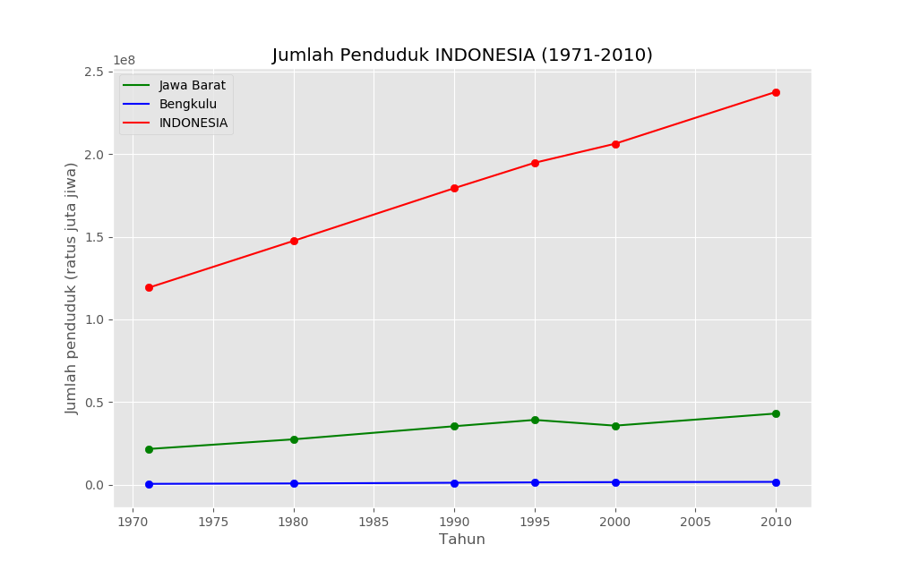
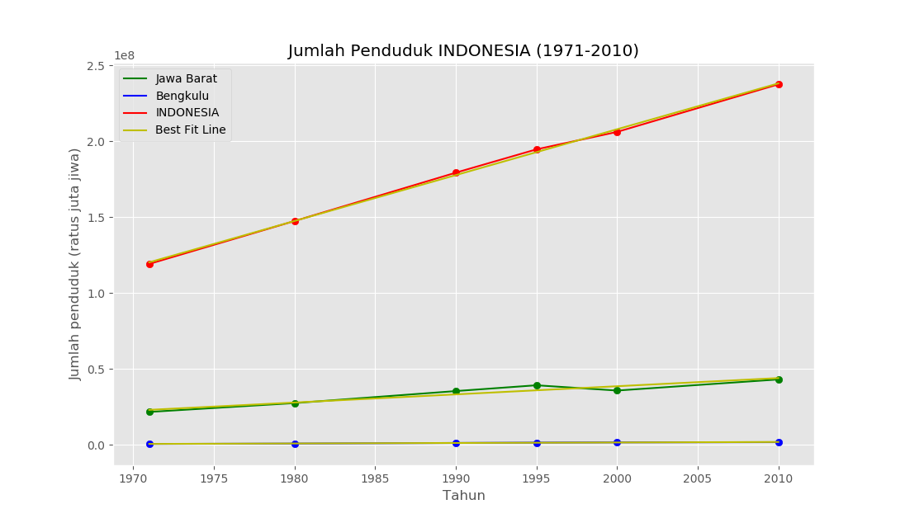

# Machine Learning Exam


#

### **Soal 1 - Jumlah Penduduk Indonesia**

Disediakan __1 buah dataset (file Excel)__ hasil sensus BPS (Badan Pusat Statistik) tentang jumlah penduduk Indonesia berdasarkan provinsi pada tahun 1971, 1980, 1990, 1995, 2000 & 2010. Unduh dataset via BPS: [unduh di sini](https://www.bps.go.id/statictable/2009/02/20/1267/penduduk-indonesia-menurut-provinsi-1971-1980-1990-1995-2000-dan-2010.html). __Dilarang keras untuk menyunting/mengubah konten dataset!__ Kemudian dengan memanfaatkan dataset tersebut, selesaikanlah soal-soal berikut:

1. Buatlah sebuah file python (__*soal1_1.py*__) yang dapat menampilkan grafik: *(1)* jumlah penduduk __Indonesia__, *(2)* jumlah penduduk dari provinsi yang memiliki __*penduduk terbanyak di tahun 2010*__, dan *(3)* jumlah penduduk dari provinsi yang memiliki __*penduduk paling sedikit di tahun 1971*__! 

    Provinsi dengan jumlah penduduk terbanyak di tahun 2010 adalah __Jawa Barat__, dan provinsi dengan jumlah penduduk paling sedikit di tahun 1971 adalah __Bengkulu__. Namun Anda __dilarang__ untuk menuliskan kata _"Jawa Barat"_, _"Bengkulu"_ dan _"Indonesia"_ di dalam script python Anda. Hasil yang diharapkan kurang lebih ditunjukkan oleh grafik berikut:

    

2. Buatlah sebuah file python (__*soal1_2.py*__) yang dapat melakukan __regresi linear__ terhadap hasil di soal sebelumnya, untuk memprediksi jumlah penduduk di masa mendatang. _(1)_ Gambarkan _best fit line_ (garis terbaik) hasil regresi pada grafik, dan _(2)_ prediksikan berapa jumlah penduduk Indonesia, Jawa Barat & Bengkulu pada tahun 2050! 

    Anda __dilarang__ untuk menuliskan kata _"Jawa Barat"_, _"Bengkulu"_ dan _"Indonesia"_ di dalam script python Anda. Hasil yang diharapkan kurang lebih ditunjukkan oleh gambar berikut:

    

    Di terminal akan muncul hasil prediksi: 

    ```bash
    Prediksi jumlah penduduk Jawa Barat di tahun 2050: 65443585
    Prediksi jumlah penduduk Bengkulu di tahun 2050: 3139135
    Prediksi jumlah penduduk INDONESIA di tahun 2050: 359273669
    ```

_**Catatan:**_ _Commit & push source code jawaban soal ini (beserta screenshot grafik) ke __Github__ Anda, buatlah repo dengan nama __Ujian_Penduduk_Indonesia__. Kemudian lampirkan __url link repo Github__ Anda via email ke lintang@purwadhika.com!_

#

### *__#HappyCoding__* :relaxed:

#### Lintang Wisesa :love_letter: _lintangwisesa@ymail.com_

[Facebook](https://www.facebook.com/lintangbagus) | 
[Twitter](https://twitter.com/Lintang_Wisesa) |
[Google+](https://plus.google.com/u/0/+LintangWisesa1) |
[Youtube](https://www.youtube.com/user/lintangbagus) | 
:octocat: [GitHub](https://github.com/LintangWisesa) |
[Hackster](https://www.hackster.io/lintangwisesa)
